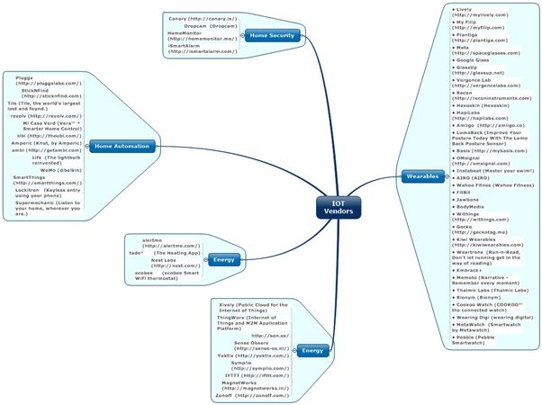
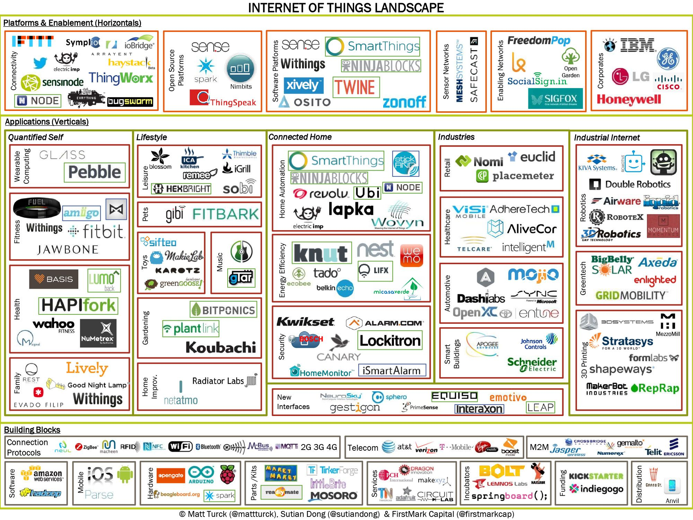

# IOT Management Market

|  | _By 2020 the IoT Will Include 26 Billion Units, Creating New Challenges for All Aspects of the Data Centre__The Internet of Things (IoT) has a potential transformational effect on the data center market, its customers, technology providers, technologies, and sales and marketing models, according to Gartner, Inc. Gartner estimates that the IoT will include 26 billion units installed by 2020, and by that time, IoT product and service suppliers will generate incremental revenue exceeding $300 billion, mostly in services.)_ |
| --- | --- |

Gartner have identified some principle challenges to the IOT market development

- Security — The increasing digitization and automation of the multitudes of devices deployed across different areas of modern urban environments are set to create new security challenges to many industries.
- Enterprise — Significant security challenges will remain as the big data created as a result of the deployment of myriad devices will drastically increase security complexity. This, in turn, will have an impact on availability requirements, which are also expected to increase, putting real-time business processes and, potentially, personal safety at risk.
- Consumer Privacy — As is already the case with smart metering equipment and increasingly digitized automobiles, there will be a vast amount of data providing information on users' personal use of devices that, if not secured, can give rise to breaches of privacy. This is particularly challenging as the information generated by IoT is a key to bringing better services and the management of such devices.
- Data — The impact of the IoT on storage is two-pronged in types of data to be stored: personal data (consumer-driven) and big data (enterprise-driven). As consumers utilize apps and devices continue to learn about the user, significant data will be generated.
- Storage Management — The impact of the IoT on storage infrastructure is another factor contributing to the increasing demand for more storage capacity, and one that will have to be addressed as this data becomes more prevalent. The focus today must be on storage capacity, as well as whether or not the business can harvest and use IoT data in a cost-effective manner.
- Server Technologies — The impact of IoT on the server market will be largely focused on increased investment in key vertical industries and organizations related to those industries where IoT can be profitable or add significant value.
- Data Center Network — Existing data center WAN links are sized for the moderate-bandwidth requirements generated by human interactions with applications. IoT promises to dramatically change these patterns by transferring massive amounts of small message sensor data to the data center for processing, dramatically increasing inbound data center bandwidth requirements.

 

##Background

http://techcrunch.com/2013/05/25/making-sense-of-the-internet-of-things/

The emerging Internet of Things — essentially, the world of physical devices connected to the network/Internet, from your Fitbit or Nest to industrial machines — is experiencing a burst of activity and creativity that is getting entrepreneurs, VCs and the press equally excited.

The space looks like a boisterous hodgepodge of smart hobbyists, new startups and large corporations that are eager to be a part of what could be a huge market, and all sorts of enabling products and technologies, some of which, including crowdfunding and 3D printing, are themselves far from established.

###Building Blocks

The concept of the Internet of Things is not new (the term itself was coined in 1999), but it is now in the process of becoming a reality thanks to the confluence of several key factors.

First, while still challenging, it is easier and cheaper than ever to produce hardware – some components are open sourced (e.g. Arduino microcontrollers); 3D printing helps with rapid prototyping; specialized providers like Dragon Innovation and PCH can handle key parts of the production process, and emerging marketplaces such as Grand St. help with distribution. Crowdfunding sites like Kickstarter or Indiegogo considerably de-risk the early phase of creating hardware by establishing market demand and providing financing.

Second, the world of wireless connectivity has dramatically evolved over the last few years. The mobile phone (or tablet), now a supercomputer in everyone’s hand, is becoming the universal remote control of the Internet of Things. Ubiquitous connectivity is becoming a reality (Wi-Fi, Bluetooth, 4G) and standards are starting to emerge (MQTT).  The slight irony of the “Internet of Things” moniker is that things are often connected via M2M (machine to machine) protocols rather than the Internet itself.

Third, the Internet of Things is able to leverage an entire infrastructure that has emerged in related areas. Cloud computing enables the creation of “dumb” (simpler, cheaper) devices, with all the intelligence processed in the cloud. Big data tools, often open sourced (Hadoop), enable the processing of massive amounts of data captured by the devices and will play a crucial role in the space.

###Verticals

Unlike the Big Data space, where the action is gradually moving from core infrastructure to vertical applications, the Internet of Things space is seeing a lot of early action directly at the vertical application level. Some notable players like Nest Labs seem to have adopted a deeply integrated vertical strategy where they control key pieces of the product, including both hardware and software, in order to have complete control over the end-user experience (a lot like Apple, which is not surprising considering the founders’ background).

Beyond the Nest, home automation in general has become the central battlefield of the Internet of Things, with some of the most exciting startups in the space jockeying for position. Another hot consumer-facing area is obviously quantified self, which is playing a huge role in developing consumers’ awareness of the potential of the Internet of Things.

Beyond consumer, B2B/enterprise vertical applications of the Internet of Things, fueled in part by robotics, hold considerable promise in a number of areas such as manufacturing, transportation, healthcare, retail and energy. Some of clearest revenue opportunities for IoT startups are in the enterprise area.

###Horizontals

While a lot of the action is happening at the vertical application level, the ultimate prize for many ambitious players in the space is to become the software platform upon which all vertical applications in the Internet of Things will be built. For example, several of the home automation providers (SmartThings, Ninja Blocks, etc.) also provide a software platform, and seem to be leveraging their vertical focus as a way to kickstart activity on the platform.

Large corporations (GE, IBM, etc.) are very active in the space and are developing their own platforms.  Carriers (AT&T, Verizon) have a large opportunity in the area, as well.

One open question is whether a platform developed for a vertical will easily translate to another vertical. In addition, whether the winning platforms are open or closed will play a huge role in the future of the space. My bet would be on openness.

The related area of connectivity (connecting objects to the network/Internet and to one another through all sorts of rules) is also a very significant opportunity.

The space is extraordinarily exciting, but still very much in its infancy – expect this chart to change dramatically over the next few months and years.

The chart to the right is an attempt at making sense of this frenetic activity. From bottom to top, I see three broad areas – building blocks, verticals and horizontals:

 
## IOT 

**Wearables**

- Live!y (http://mylively.com)
- My Filip (http://myfilip.com)
- Plantiga (http://plantiga.com)
- Meta (http://spaceglasses.com)
- Google Glass
- GlassUp (http://glassup.net)
- Vergence Lab (http://vergencelabs.com)
- Recon (http://reconinstruments.com)
- Hexoskin (Hexoskin)
- HapiLabs (http://hapilabs.com)
- Amiigo (http://amiigo.co)
- LumoBack (Improve Your Posture Today With The Lumo Back Posture Sensor)
- Basis (http://mybasis.com)
- OMsignal (http://omsignal.com)
- Instabeat (Master your swim!)
- AIRO (AIRO)
- Wahoo Fitnes (Wahoo Fitness)
- FitBit
- Jawbone
- BodyMedia
- Withings (http://withings.com)
- Gecko (http://geckotag.me)
- Kiwi Wearables (http://kiwiwearables.com)
- Weartrons (Run-n-Read, Don't let running get in the way of reading)
- Embrace+
- Memoto (Narrative - Remember every moment)
- Thalmic Labs (Thalmic Labs)
- Bionym (Bionym)
- Cookoo Watch (COOKOO™ the connected watch)
- Wearing Digi (wearing digital)
- MetaWatch (Smartwatch by Metawatch)
- Pebble (Pebble Smartwatch)

**Home automation**

- Pluggx (http://pluggxlabs.com/)
- StickNFind (http://sticknfind.com)
- Tile (Tile, the world's largest lost and found.)
- revolv (http://revolv.com/)
- Mi Casa Verd (Vera™ ▾ Smarter Home Control)
- Ubi (http://theubi.com/)
- Amperic (Knut, by Amperic)
- ambi (http://getambi.com)
- Lifx (The lightbulb reinvented)
- WeMo (@belkin)
- SmartThings (http://smartthings.com/)
- Lockitron (Keyless entry using your phone)
- Supermechanic (Listen to your home, wherever you are.)

**Home Security**

- Canary (http://canary.is/)
- Dropcam (Dropcam)
- HomeMonitor (http://homemonitor.me/)
- iSmartAlarm (http://ismartalarm.com/)

**Energy efficiency**

- alertme (http://alertme.com/)
- tado° (The Heating App)
- Nest Labs (http://nest.com/)
- ecobee (ecobee Smart WiFi thermostat)

**Software platforms**

- Xively (Public Cloud for the Internet of Things)
- ThingWorx (Internet of Things and M2M Application Platform)
- http://sen.se/
- Sense Observ (http://sense-os.nl/)
- Yuktix (http://yuktix.com/)
- Symplio (http://symplio.com/)
- IFTTT (http://ifttt.com/)
- MagnetWorks (http://magnetworks.in/)
- Zonoff (http://zonoff.com/)

 ![] (commercial2.jpg)

## IOT Vendor - Thingworx

ThingWorx™ provides the first platform designed to efficiently build and run the applications of today's connected world. ThingWorx's model-based design and search-based intelligence reduces application development efforts by 10X, minimizing cost, risk, and time to market. - See more at: http://www.thingworx.com/#sthash.tCA9r2rA.dpuf

ThingWorx enables rapid creation of end-to-end "smart" applications for a wide range of markets including: Smart Agriculture, Smart Cities, Smart Grid, Smart Water, Smart Buildings, and Telematics. - See more at: [http://www.thingworx.com/#sthash.tCA9r2rA.dpuf](http://www.thingworx.com/#sthash.tCA9r2rA.dpuf)

ThingWorx is used with connected products in markets such as Medical/Healthcare, Construction Equipment, Transportation, Financials, Public Safety, and Consumer Products. - See more at: [http://www.thingworx.com/#sthash.tCA9r2rA.dpuf](http://www.thingworx.com/#sthash.tCA9r2rA.dpuf)

ThingWorx enables a new level of connectedness and intelligence for traditional industries, benefitting markets such as Automotive, Life Sciences, Manufacturing, Mining, Oil & Gas, Food & Beverage, and Utilities. - See more at: [http://www.thingworx.com/#sthash.tCA9r2rA.dpuf](http://www.thingworx.com/#sthash.tCA9r2rA.dpuf)

#### Acquisition

[http://www.thingworx.com/2013/12/ptc-acquires-leading-internet-of-things-platform-provider-thingworx/](http://www.thingworx.com/2013/12/ptc-acquires-leading-internet-of-things-platform-provider-thingworx/)

**NEEDHAM, MASS., December 30, 2013 –****  **[_PTC_](http://www.ptc.com/)** **_(Nasdaq: PTC) today announced it has acquired___ [_ThingWorx_](http://www.thingworx.com/)_, creators of an award-winning platform for building and running applications for the Internet of Things (IoT), for approximately $112 million, plus a possible earn-out of up to $18 million. The acquisition of ThingWorx positions PTC as a major player in the emerging Internet of Things era._

_The ThingWorx acquisition extends PTC's strategy by accelerating its ability to support manufacturers seeking competitive advantage as they create and service smart, connected products. As part of PTC, ThingWorx will continue to help customers in a wide range of industries seeking to leverage the IoT, including telecommunications, utilities, medical devices, agriculture, and transportation, as well as an emerging partner network of IoT-enabled service providers._

_According to a recent research report ___ [_Disruptive technologies: Advances that will transform life, business, and the global economy_](http://www.mckinsey.com/insights/business_technology/disruptive_technologies)___ (May, 2013) ____ from the McKinsey Global Institute __,__ __the Internet of Things has the potential to create economic impact of $2.7 trillion to $6.2 trillion annually by 2025. The firm believes perhaps 80 to 100 percent of all manufacturing could be using Internet of Things applications by then, leading to potential economic impact of $900 billion to $2.3 trillion, largely from productivity gains. For example, with increasingly sophisticated Internet of Things technologies becoming available, companies can not only track the flow of products or keep track of physical assets, but they can also manage the performance of individual machines and systems._

_In the IoT era, PTC's customers are bringing to market increasingly smart and connected products which can generate value in new ways as streams of real-time operational data are captured, analyzed, and shared to deepen a company's understanding of its products' performance, use, and reliability. PTC will use the ThingWorx platform to speed the creation of high value IoT applications that support manufacturers' service strategies, such as predictive maintenance and system monitoring, in complement to PTC's existing ___ [_service lifecycle management (SLM)_](http://www.ptc.com/solutions/service-lifecycle-management/)___ and extended ___ [_product lifecycle management (PLM)_](http://www.ptc.com/solutions/product-lifecycle-management/)___ solution portfolio. With ThingWorx, PTC will also now offer its customers a means to establish a secure, reliable connection to their products as well as a platform to rapidly develop applications for maintaining and operating them – and ultimately for finding ways to create new value from them._

_"All aspects of our strategy to date have centered on helping manufacturing companies transform how they create and service smart, connected products," said PTC president and CEO Jim Heppelmann. "For manufacturers today, it is clear to us that improved service strategies and service delivery is the near-term 'killer app' for the Internet of Things and this opportunity has guided our strategy for some time. With this acquisition, PTC now possesses an innovation platform that will allow us to accelerate how we help our customers capitalize on the market opportunity that the IoT presents."_

_The opportunity, however, goes well beyond this immediate pragmatic application. Industries of all types are poised to see disruption from the Internet of Things and the expanding networks of connected sensors and devices, and a growing ecosystem of ThingWorx partners is forming to capitalize on this growth. As part of PTC, ThingWorx intends to continue serving this diverse market with senior management continuing to focus on its current path._

_"At ThingWorx, we share PTC's vision for helping organizations fundamentally leverage the connected world," said Russell Fadel, CEO and co-founder, ThingWorx. "We believe all industries, but especially manufacturing, will be transformed in the Internet of Things era. We are excited to pursue this broad set of opportunities with the resources and proven solution portfolio that PTC provides."_

_The acquisition is expected to add more than $10 million of revenue over the next 12 months, with $5 million to $7 million of revenue in FY'14. As a result of cost synergies and investment plans for ThingWorx, PTC still expects FY'14 non-GAAP EPS of $2.00 to $2.10. PTC drew $110 million from its credit facility to finance the transaction._

_- See more at: http://www.thingworx.com/2013/12/ptc-acquires-leading-internet-of-things-platform-provider-thingworx/#sthash.IeCJvR09.dpuf_

## IOT Vendor - Evrything

EVRYTHNG is a Web of Things™ software company, making products smart by connecting them to the Web. EVRYTHNG helps manufacturers connect directly with customers and partners through their own products, using smartphones and intelligent identities for physical products on the Web.

The technology at the heart of making products smart is the EVRYTHNG Engine which makes it easy to turn any physical thing into a channel for personalized digital services, one-to-one communications and ongoing relationships, tied to transactions.

By making products smart, EVRYTHNG's technology helps world-leading brands get closer to their customers and access real-time data analytics about how their products are being made, sold and used. EVRYTHNG is enabling the Web of Things™ by powering the next revolution in customer interaction and product experiences.

The EVRYTHNG Engine provides high scale, industrial technology to create and serve millions of Active Digital Identities™ for a company's products and other objects. These unique online profiles create a persistent, unique digital presence for any physical object on the Web. Think of a Facebook for Things™ where individual objects, just like people on social networks, have their own unique digital profiles that enable communications, apps and services.

The Evrythg architecture is a centralised architecture where all infomraion is passed through a central repository.

## IOT Vendor - Alertme

AlertMe is a UK company that provides energy and home monitoring hardware and services. AlertMe produces hardware and software to enable users to monitor and control their home energy use.

## IOT Vendor - Xively

Xively by LogMeIn is dedicated to helping make the IoT real for your business as a trusted partner. Our years of experience and robust solution portfolio simplifies the complexities of the IoT, resulting in the accelerated discovery, design and implementation of real solutions that drive real results for your business.

XIvely was oringally pachube (later COSM) and was acquired in 2011 by logmein

[http://techcrunch.com/2011/07/20/logmein-acquires-internet-of-things-startup-pachube-for-15m-in-cash/](http://techcrunch.com/2011/07/20/logmein-acquires-internet-of-things-startup-pachube-for-15m-in-cash/)

[_LogMeIn_](http://logmein.com/)_, which lets you remotely control computers and mobiles, has acquired___ [_Pachube_](http://pachube.com/)_, a UK startup which is building software for sensor-enabled devices or the legendary "Internet of Things". The $15 million purchase is all cash. We understand the team is staying on._

_Pachube networks appliances, environmental sensors, cars and personal health monitors – you name it, this is a market set to explode over the next few years. Michael Simon, CEO of LogMeIn said the purchase will extend its Gravity platform into smart embedded devices._

_Pachube's realtime monitoring platform means users send more than seven million datapoints to the service each day. Founder, Usman Haque said "we are in a strong position to bring our shared vision for the Internet of Things to fruition."_

_It's also another "win" for a company based in the 'Silicon Rounadabout' area of London which the UK government is trying to re-brand internationally as "TechCity"._